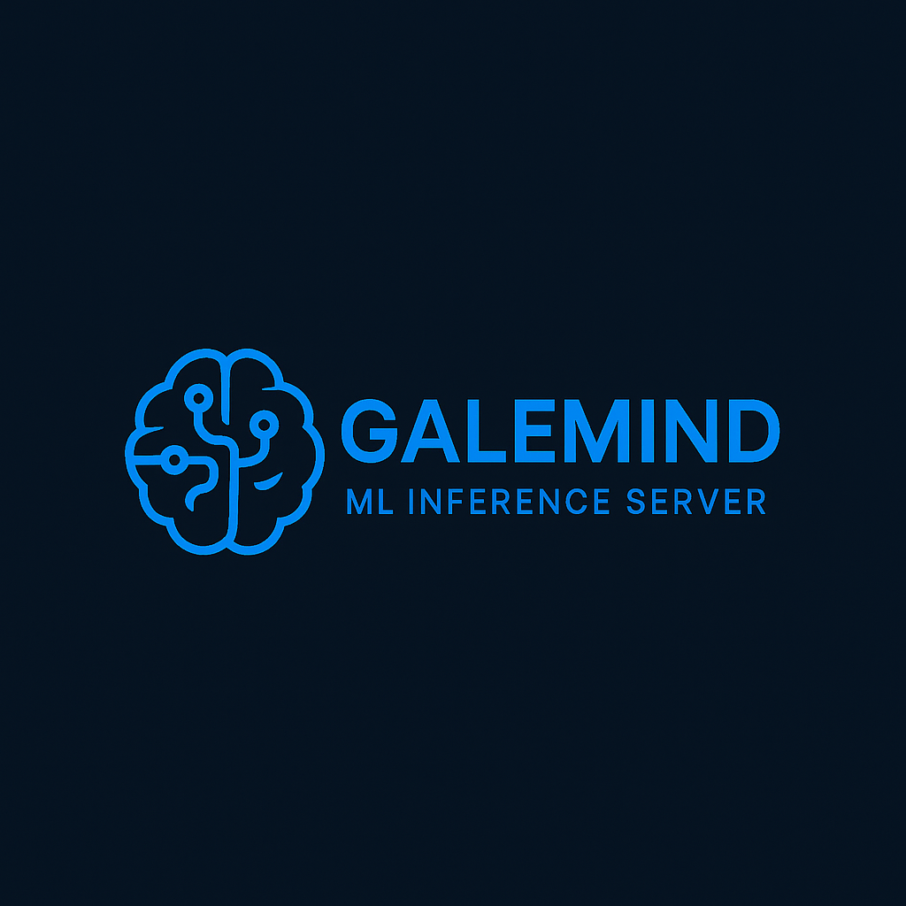

## GaleMine - StreamGale Machine Learning Inference Service

|  | Galemind is an inference server designed to integrate with the StreamGale framework. It enables the deployment and serving of machine learning models with a clean, modular, and developer-friendly architecture. |
|:--:|:--|

---

## 🚀 Features

- **🧠 Model Serving** – Efficient deployment and inference of machine learning models.
- **🧩 Modular Architecture** – Clear separation between engine logic and model definitions.
- **🐳 Containerization Support** – Includes `.devcontainer/` setup for VS Code + Docker development.

