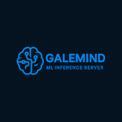

## GaleMind - StreamGale Machine Learning Inference Service

|  | Galemind is an inference server designed to integrate with the StreamGale framework. It enables the deployment and serving of machine learning models with a clean, modular, and developer-friendly architecture. |
|:--:|:--|

---

## 🚀 Features

- **🧠 Model Serving** – Efficient deployment and inference of machine learning models.
- **🧩 Modular Architecture** – Clear separation between engine logic and model definitions.
- **🐳 Containerization Support** – Includes `.devcontainer/` setup for VS Code + Docker development.

---

## 🗂 Repository Structure

```
galemind/
├── .devcontainer/     # Configuration for development containers
├── .github/           # GitHub action workflows
├── engine/            # Core engine logic for the inference server
├── models/            # Machine learning model definitions and training CLI
├── .gitignore         # Specifies files to ignore in version control
├── LICENSE            # MIT License
└── README.md          # Project documentation
```

---

## ⚙️ Getting Started

### Prerequisites

Make sure you have the following installed:

- Python 3.8+
- Rust
- [Docker](https://www.docker.com/) *(optional, for container-based dev)*
- [`uv`](https://github.com/astral-sh/uv) (fast Python package/dependency manager)
- `make`

---

### 🔧 Installation

1. **Clone the repository:**

```bash
git clone https://github.com/zenforcode/galemind.git
cd galemind
```

2. **Compile the core engine (Rust):**

```bash
make
```

3. **Launch the server**

```bash
make run
```

---

## 🧪 Model Examples

Model training and inference utilities are available in the `models/` directory.

### Setup for Python model training

1. **Create a virtual environment and install dependencies:**

```bash
cd models
uv venv .venv
source .venv/bin/activate
uv pip install -e .
```

2. **Train a model using the CLI:**

```bash
train --epochs 5 --batch-size 64
```

> `train` is a Typer-based CLI tool for training a simple CNN on the MNIST dataset. The model will be saved as `digit_detector.pth`.

---

## 🧱 License

This project is licensed under the [MIT License](./LICENSE).
